# Baku Real Estate Market Analysis
## Executive Business Intelligence Report

---

## Overview

This report presents a comprehensive analysis of the Baku real estate market based on **340 property listings** from vipemlak.az. The findings provide actionable insights for investors, developers, and real estate professionals operating in Azerbaijan's property market.

---

## Key Market Highlights

| Metric | Value |
|--------|-------|
| **Total Properties Analyzed** | 340 |
| **Properties for Sale** | 272 (80%) |
| **Properties for Rent** | 68 (20%) |
| **Average Sale Price** | 221,209 AZN |
| **Median Sale Price** | 171,000 AZN |
| **Average Monthly Rent** | 773 AZN |
| **Price Range** | 12,500 - 1,390,000 AZN |

---

## Strategic Findings

### 1. Market Composition: Sales Dominate the Listings

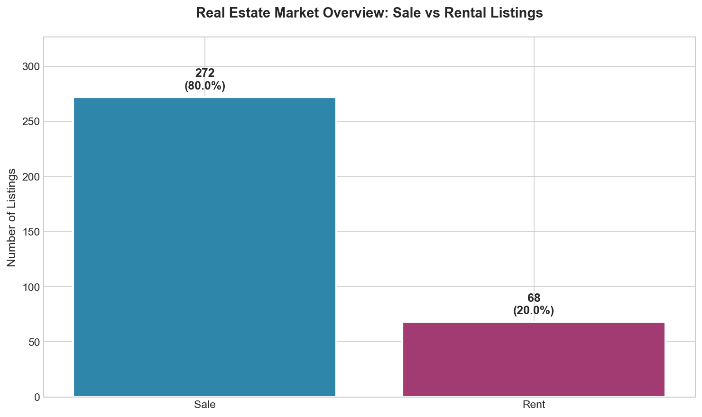

**What This Shows:** The market is heavily weighted toward property sales (80%) rather than rentals (20%).

**Why This Matters:**
- Property investment and ownership is the primary focus of current market activity
- Limited rental inventory may indicate opportunity for buy-to-let investors
- Developers should consider rental-oriented projects to address market gap

**Recommended Actions:**
- Investors seeking rental income should act quickly on available inventory
- Property managers should expect high occupancy rates given limited rental supply

---

### 2. Geographic Hotspots: Where Properties Are Concentrated

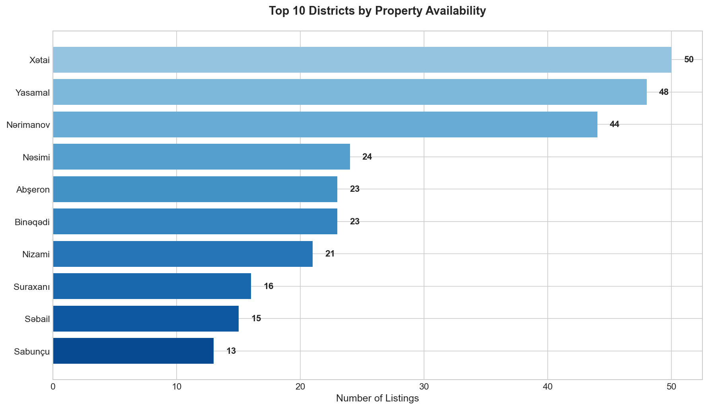

**What This Shows:** Property availability varies significantly across Baku's districts. The top districts dominate market inventory.

**Why This Matters:**
- High-inventory districts indicate established markets with more options for buyers
- Low-inventory districts may represent emerging opportunities or limited development
- Distribution pattern reveals where developers are most active

**Recommended Actions:**
- Buyers in high-inventory areas have negotiating leverage
- Investors should monitor low-inventory districts for emerging growth areas
- Developers should consider underserved districts for new projects

---

### 3. Pricing Landscape: District-Level Value Analysis

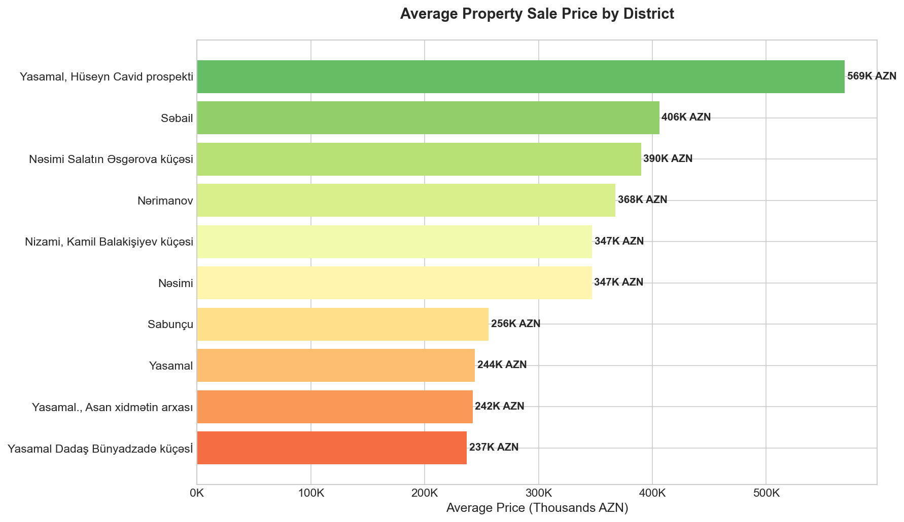

**What This Shows:** Average property sale prices vary dramatically by location, with premium districts commanding significantly higher prices.

**Why This Matters:**
- Price differences of 2-3x between districts indicate distinct market segments
- Location remains the primary driver of property value in Baku
- Clear price tiers help buyers match budget to realistic location options

**Recommended Actions:**
- Budget-conscious buyers should focus on emerging districts
- Premium property seekers should target high-value established areas
- Investors should compare appreciation potential across price tiers

---

### 4. Value Index: Price per Square Meter

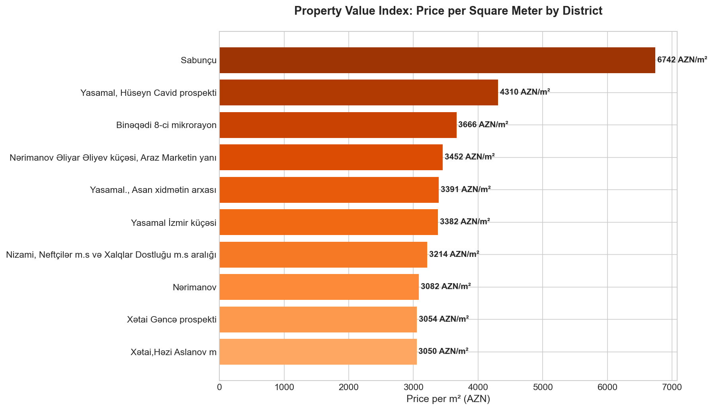

**What This Shows:** The true cost of living space varies by district when normalized per square meter, revealing actual property value density.

**Why This Matters:**
- Price per sqm is the most objective comparison metric across properties
- Districts with high sqm prices reflect premium locations and quality
- Helps identify whether a specific property is over or underpriced for its area

**Recommended Actions:**
- Use district averages as benchmarks when evaluating specific properties
- Properties significantly below district average may indicate negotiation opportunity or issues
- Properties above average should demonstrate clear value-adds to justify premium

---

### 5. Market Demand: Room Configuration Preferences

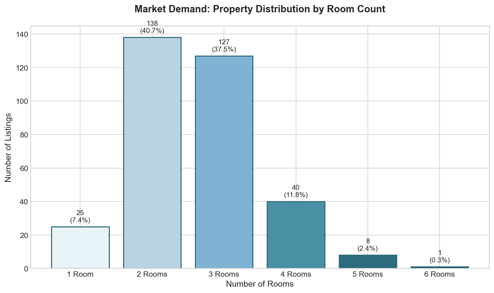

**What This Shows:** 2-3 room apartments dominate the market, reflecting the most common demand profile.

**Why This Matters:**
- 2-3 room properties represent the "sweet spot" for typical buyers (families, young professionals)
- Limited supply of larger properties (4+ rooms) may indicate premium pricing opportunity
- Studio/1-room properties serve specific demographics (singles, investors)

**Recommended Actions:**
- Developers should prioritize 2-3 room units for maximum market absorption
- Sellers of larger properties may find less competition and more negotiating power
- Investors should focus on high-demand room configurations for liquidity

---

### 6. Market Segmentation: Property Price Tiers

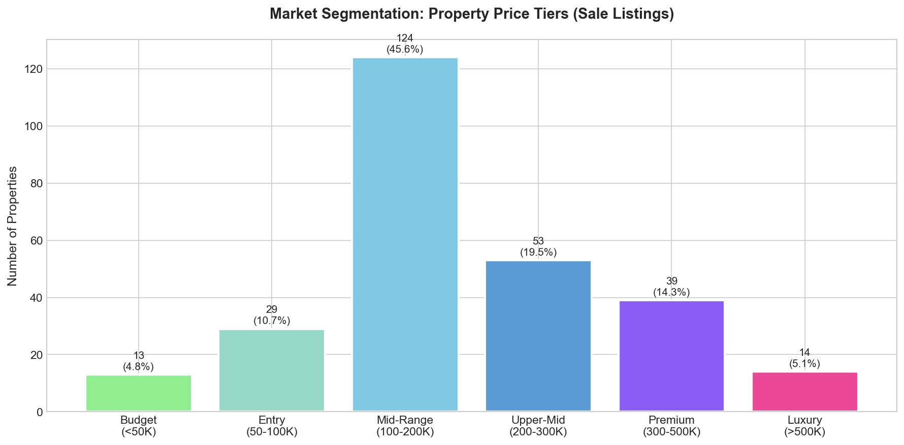

**What This Shows:** The sale market breaks down into distinct price segments from budget to luxury.

**Why This Matters:**
- Understanding segment sizes helps position new developments appropriately
- Mid-range properties (100K-200K) represent the largest market segment
- Luxury segment (500K+) is a niche market with limited but specific demand

**Recommended Actions:**
- Most developers should target mid-range segment for volume
- Luxury developers should expect longer sales cycles but higher margins
- Mortgage providers should structure products for the 100K-300K range

---

### 7. Rental Market Structure

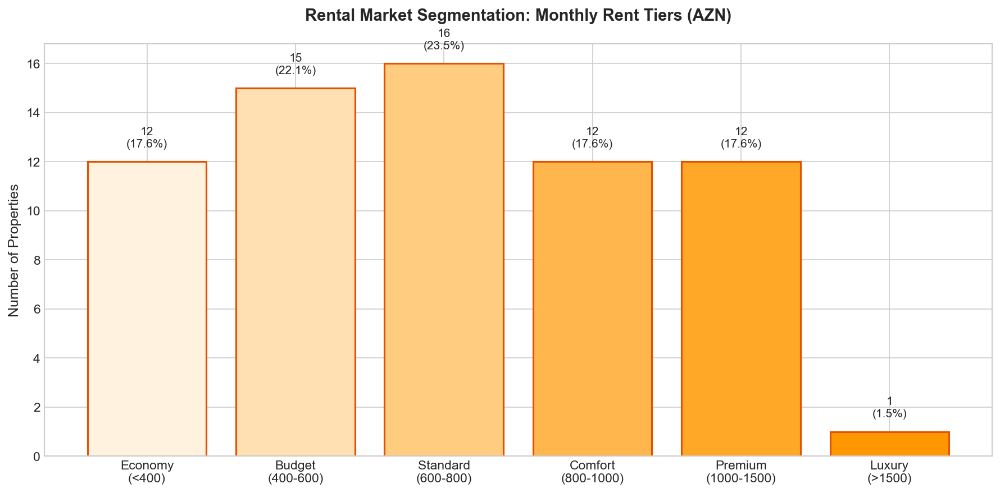

**What This Shows:** Monthly rental prices cluster around specific tiers, with most properties in the 400-1000 AZN range.

**Why This Matters:**
- Rental pricing shows clear market expectations by tier
- Economy rentals (<400 AZN) represent affordable housing demand
- Premium/luxury rentals (>1000 AZN) serve corporate and expat tenants

**Recommended Actions:**
- Landlords should price within established tiers for faster leasing
- Property managers should segment marketing by rental tier
- Investors should calculate yields based on realistic rental expectations

---

### 8. Market Players: Top Real Estate Agents

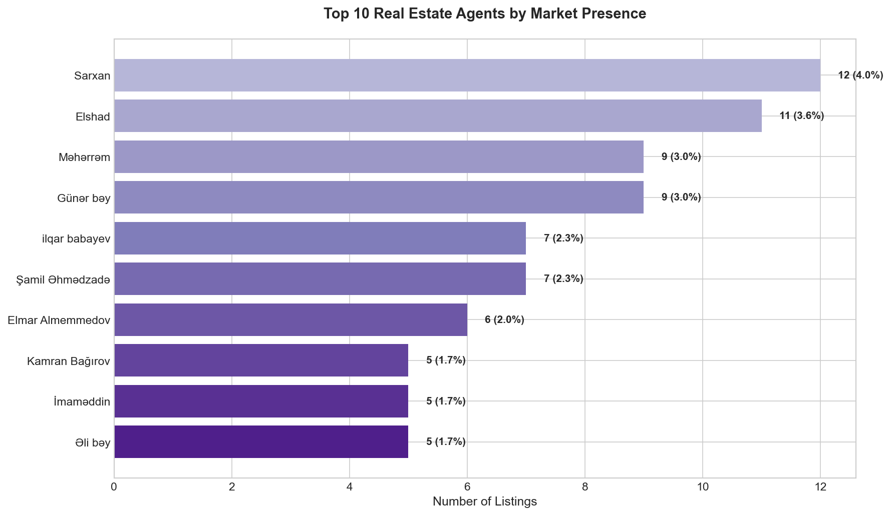

**What This Shows:** Market presence concentration among top agents and agencies.

**Why This Matters:**
- Top agents have established networks and market access
- Market share distribution indicates competitive landscape
- Agent expertise correlates with transaction volume

**Recommended Actions:**
- Sellers should consider listing with high-volume agents for maximum exposure
- Buyers can approach top agents for access to more inventory
- New agents should study market leaders' strategies

---

### 9. Size-Price Relationship

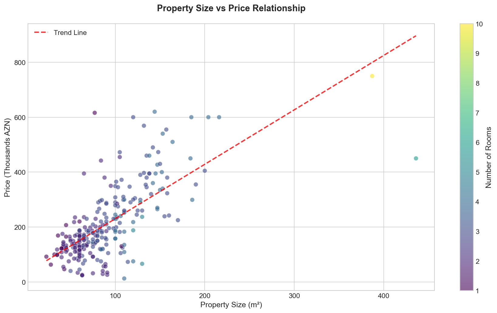

**What This Shows:** Property size correlates with price, with room count as an additional value factor.

**Why This Matters:**
- Larger properties command higher prices, but not always proportionally
- Some property sizes offer better value per sqm than others
- Room count adds value beyond raw square footage

**Recommended Actions:**
- Buyers should compare price-per-sqm across similar-sized properties
- Properties below the trend line may represent good value
- Developers should optimize unit sizes for target price points

---

### 10. Investment Opportunity: Rental Yields

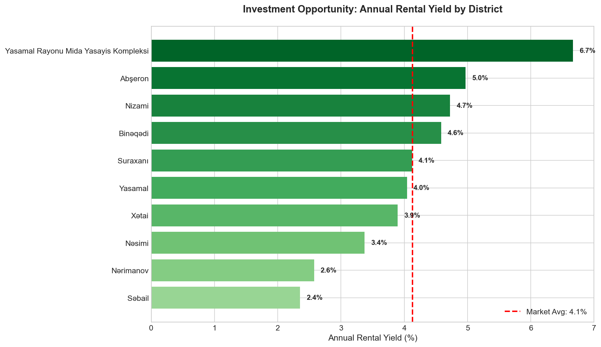

**What This Shows:** Annual rental yield varies by district, indicating where investment returns are strongest.

**Why This Matters:**
- Higher yields indicate better cash flow potential for buy-to-let investors
- Districts above market average offer superior income returns
- Yield variations reflect different risk-return profiles

**Recommended Actions:**
- Income-focused investors should prioritize high-yield districts
- Lower-yield premium areas may offer better capital appreciation
- Balance yield vs. appreciation based on investment strategy

---

### 11. Property Type Distribution

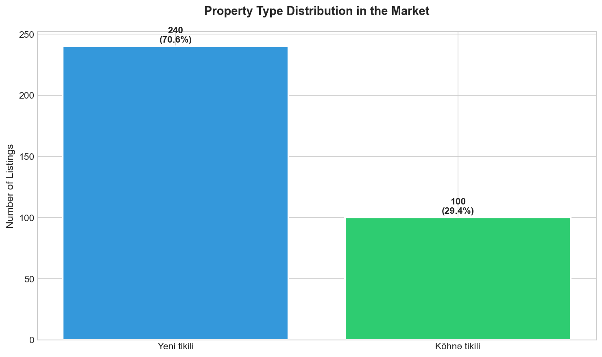

**What This Shows:** The breakdown of property types in the current market inventory.

**Why This Matters:**
- New construction (Yeni tikili) dominates the market
- Property type affects pricing, maintenance, and buyer preferences
- Market composition indicates development trends

**Recommended Actions:**
- Buyers preferring modern amenities should focus on new construction
- Historic property fans may find less competition in older buildings
- Developers should continue new construction focus based on demand

---

## Executive Summary: Key Takeaways

### For Investors
1. **Best Yields:** Focus on districts showing above-market rental yields for income properties
2. **Sweet Spot:** 2-3 room apartments in the 100K-200K range offer best liquidity
3. **Rental Gap:** Limited rental supply (20% of market) creates opportunity

### For Developers
1. **Target Segment:** Mid-range properties (100K-200K AZN) have highest demand
2. **Room Mix:** Prioritize 2-3 room units for maximum market absorption
3. **Location:** Consider underserved districts for reduced competition

### For Buyers
1. **Negotiation:** High-inventory districts offer more negotiating leverage
2. **Value Benchmark:** Use district price-per-sqm averages to identify deals
3. **Timing:** Sales-heavy market provides broad selection

### For Sellers
1. **Agent Selection:** High-volume agents provide maximum market exposure
2. **Pricing:** Price within established segment tiers for faster sale
3. **Positioning:** Highlight value-adds that justify above-average pricing

---

## Methodology

This analysis is based on 340 property listings scraped from vipemlak.az, covering both new construction (Yeni tikili) and older buildings (Kohne tikili) across Baku and surrounding areas. Data includes property prices, sizes, room counts, locations, and agent information.

---

## How to Regenerate Charts

To regenerate all charts with updated data:

```bash
python generate_charts.py
```

Charts are saved to the `charts/` directory.

---

*Report generated for business decision-making purposes. Data reflects market conditions at time of collection.*
